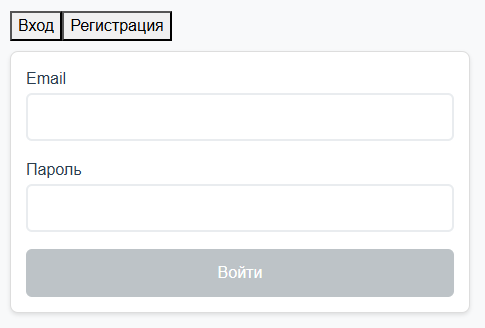
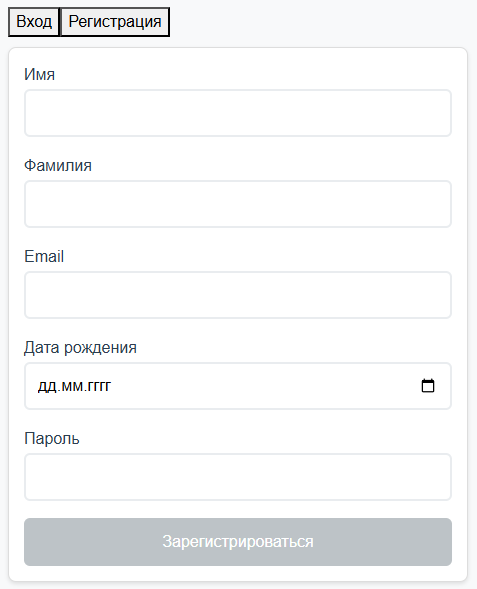
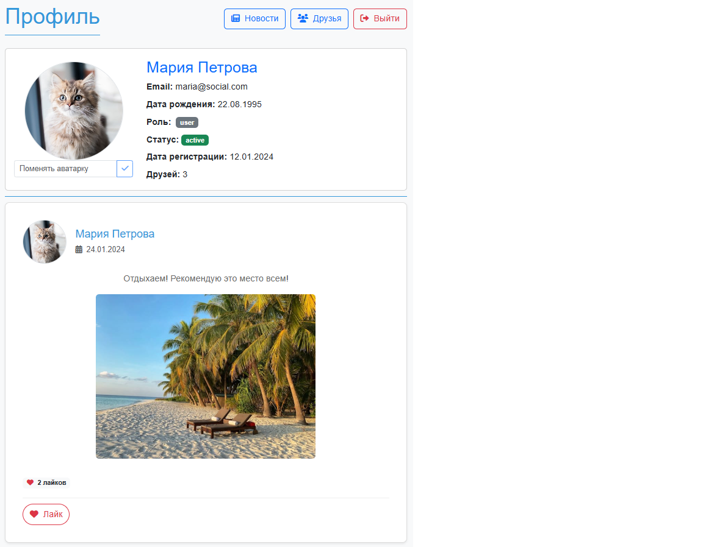
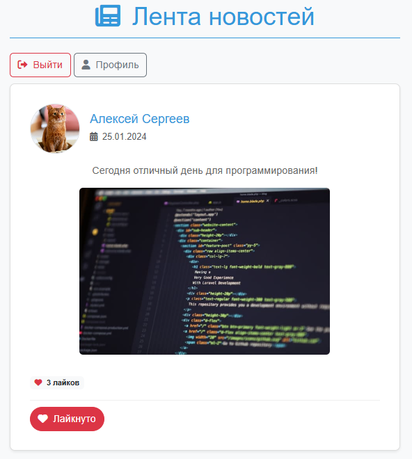
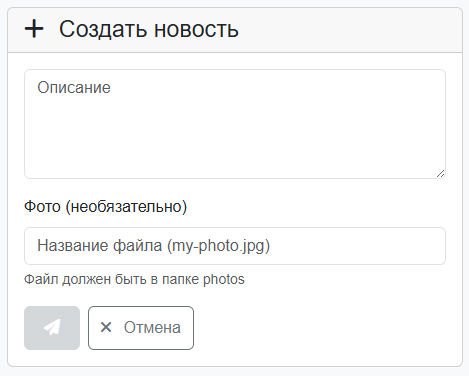
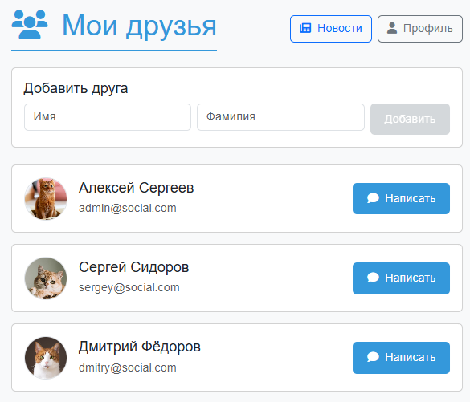
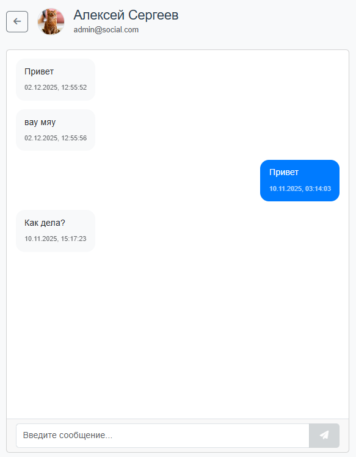
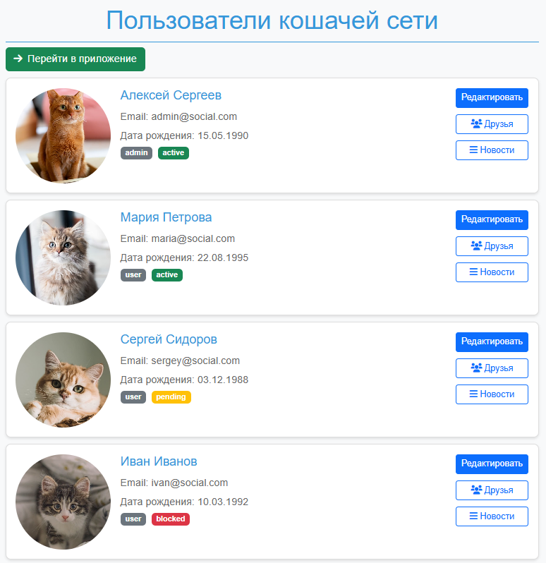
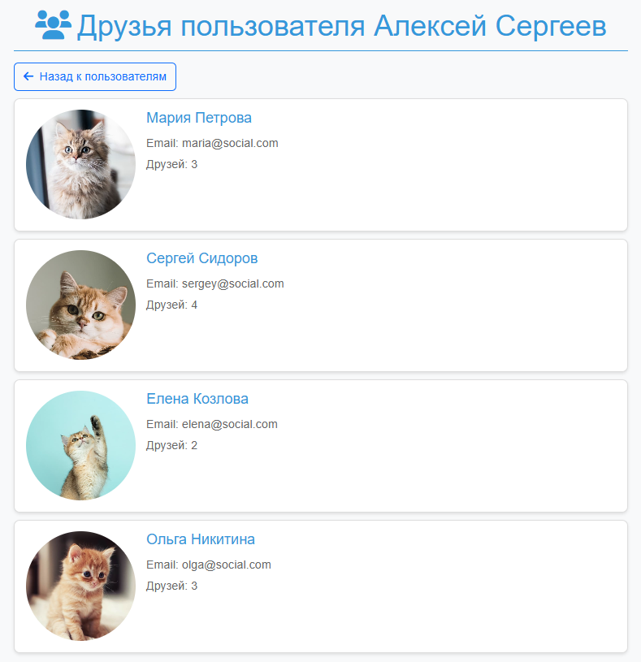

# Social Network

Веб-приложение социальной сети.

Позволяет публиковать и оценивать новости, добавлять друзей и общаться в чате. Данные обновляются в реальном времени за счёт `Server-Sent Events`.

## Установка и запуск

Клонирование репозитория:

```bash
https://github.com/nhitar/social-network.git
cd social-network
```

Нужно создать самоподписанный сертификат для `https`:

```bash
mkdir -p admin/keys
cd admin/keys

openssl req -x509 -newkey rsa:2048 -nodes -keyout server.key -out server.cert -days 365 -subj "/CN=localhost"

cd ..
```

Установка зависимостей и запуск сервера:

```bash
npm i

npm run dev
```

Сервер: `localhost:3000`.

Панель администратора: `localhost:3001`.

Соцсеть: `localhost:4200`.

## Демонстрация сайта

`Страничка авторизации`



`Страничка регистрации`



`Профиль`



`Новости`



`Создать новость`



`Друзья`



`Чат с другом`



`Панель администратора, пользователи`



`Панель администратора, друзья пользователя`


